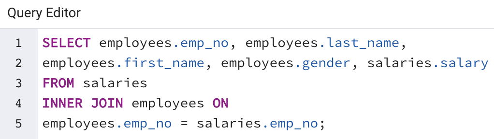
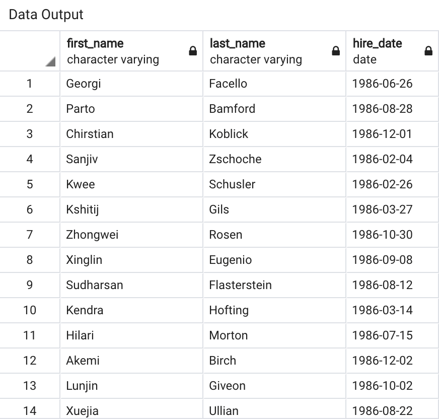

# SQL Challenge

## Overview:
A company's employee data was analyzed by creating a SQL database and using SQL queries and CRUD functions. 

## Data:
The six csv files contain data about the employees' name, ID, birth date, gender and start and end dates of employment. They also contain data about departments, salaries, department managers and employee titles.

## Workflow:

An Entity Relationship Diagram (ERD) sketch was created to visualize the data structure:

A table schema was created for each of the six CSV files, and the files were imported into the corresponding SQL table. SQL queries were used to select specific information, merge tables, and sort values.

- List the employee number, last name, first name, gender, and salary for each employee:

- List employees who were hired in 1986:

